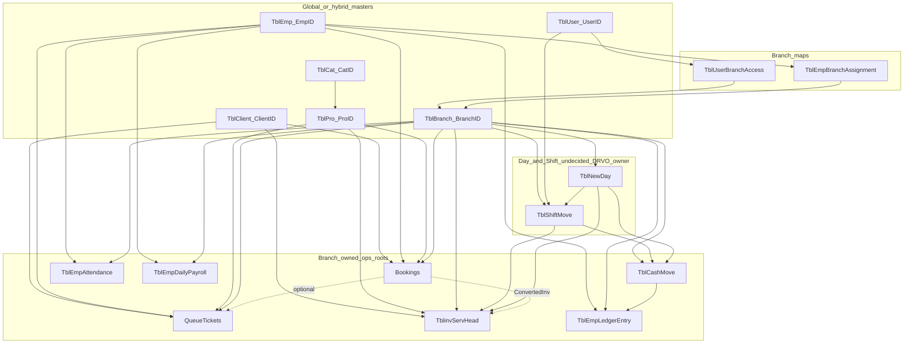
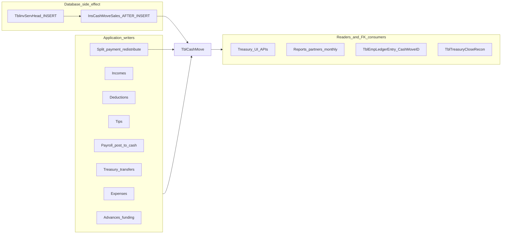
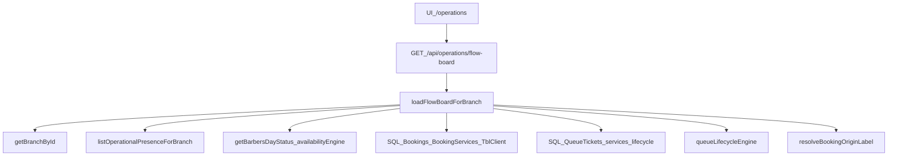
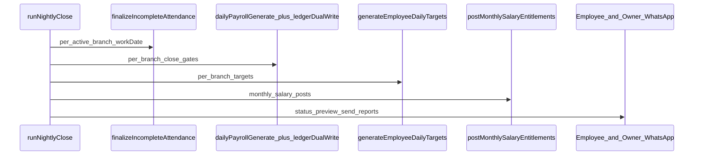
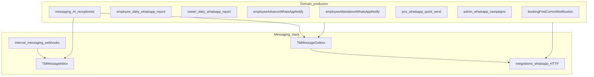
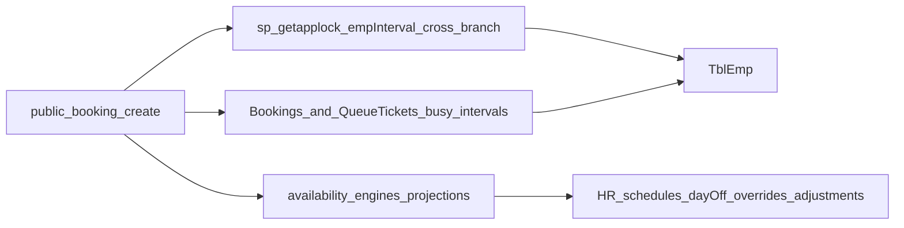
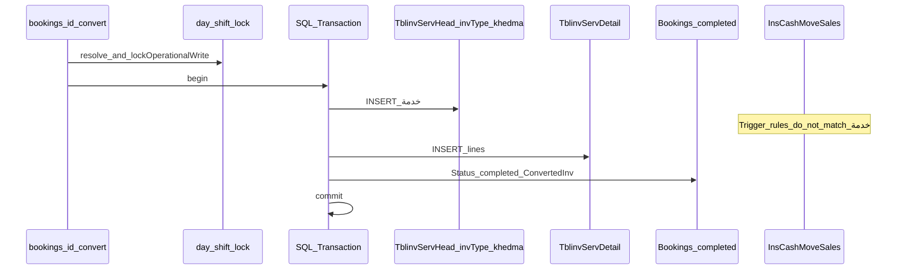
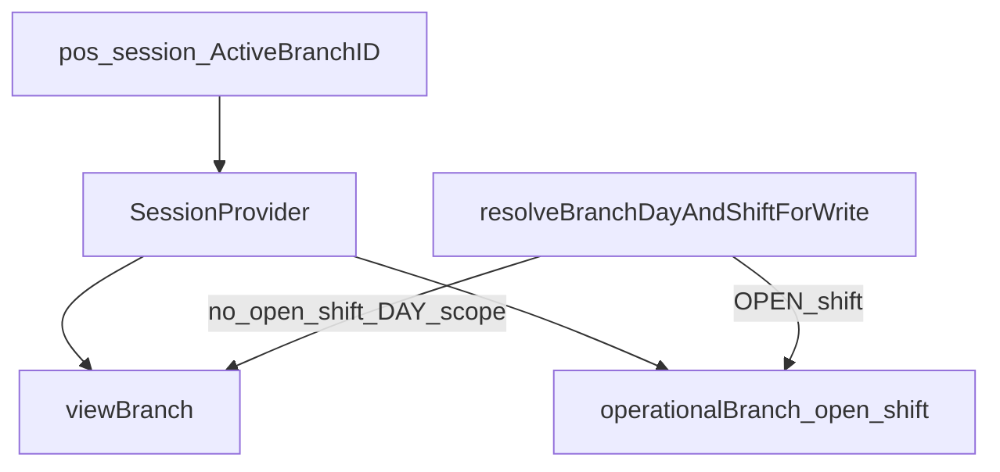

# DRVO-001 — Dependency Graph

| Field | Value |
|-------|-------|
| Document | `DRVO-001-DEPENDENCY-GRAPH` |
| **Audited Git HEAD SHA** | `f5e43773545d25467af7b302b974191418a3f8dd` |
| Authority | Audit only. Graphs describe **VERIFIED CURRENT STATE** couplings. Any “target” notes are **INFERRED FUTURE DESIGN** (provisional). Decisions → **DRVO-002**. |

Companions: [EXTRACTION-AUDIT](./DRVO-001-EXTRACTION-AUDIT.md) · [DOMAIN-MAP](./DRVO-001-DOMAIN-MAP.md) · [MIGRATION-ORDER](./DRVO-001-MIGRATION-ORDER.md)

---

## 1. Identity and FK relationships (VERIFIED CURRENT STATE)

**Notes**

- Employee busy intervals for booking/queue are intentionally **cross-branch** (`EMPLOYEE_GLOBAL_CONFLICT` in `domainOwnershipRegistry.ts`; `empIntervalLockResource` in `publicBookingCreateLocks.ts`).
- Invoice identity is composite `(invID, invType)` — not shown as a single surrogate.

---

## 2. TblCashMove financial hub — app writers + DATABASE trigger (VERIFIED CURRENT STATE)

**Evidence**

- Sales API (`/api/sales`): initial CashMove **not** inserted in app code — comments name trigger `InsCashMoveSales` as single path; runs inside same SQL TX as head INSERT.
- Trigger body (migration): `db/migrations/add-financial-branch-ownership.sql`; legacy scalar snapshot: `scripts/audit-branches/_insCashMoveSales.sql`.
- Matching invTypes: `مبيعات` / `مبيعات بالكارت` (+ reverse `م.*`); requires `ReservTime IS NULL` for primary sale types; inherits Branch/Day in migrated form.
- Booking convert inserts `invType=N'خدمة'` → **does not match** trigger rules (no CashMove from this path expected).
- Split: trigger clearing “in” + app `redistributeFromClearing` same TX.
- Production trigger enabled: **NEEDS RUNTIME VERIFICATION** (verify script exists; audit did not run live).

**Extraction implication (INFERRED FUTURE DESIGN):** crossing a service/DB boundary without an **explicit posting contract** can break trigger-backed atomicity. Contract design is deferred to DRVO-002.

**Risk:** Critical.

---

## 3. Operations flow-board coupling (VERIFIED CURRENT STATE)

**Evidence:** `src/lib/operations/loadFlowBoardForBranch.ts` imports HR ops day state, availability engine, queue lifecycle, booking datetime/origin helpers, and runs parallel SQL for barbers/bookings/queue.

**Implication:** `/operations` is a **composition surface**, not a clean persistence domain. Extraction of Booking/Queue without a read-model or BFF will break floor UX unless a replacement composition API is designed (**INFERRED FUTURE DESIGN**).

---

## 4. Nightly-close orchestration (VERIFIED CURRENT STATE at HEAD)

Verified via `git show HEAD:src/lib/hr/nightly-close.service.ts` (working-tree file may differ — **OUT-OF-BASELINE** if dirty).

**Stitches domains:** attendance → payroll → employee ledger dual-write → targets → messaging.

**Risk:** Critical hidden monolith job.

---

## 5. Messaging fan-in (VERIFIED CURRENT STATE)

**Distinction for migration (provisional):**

- **Platform prerequisite:** durable outbox/inbox + webhook auth + correlation (infra already partially present).
- **Messaging app extraction:** campaigns, inbox UX, AI receptionist, template admin — **not required before Booking**.

---

## 6. Booking ↔ workforce / schedule / global conflicts (VERIFIED CURRENT STATE)

**Evidence**

- `empIntervalLockResource(empId, startMs, endMs)` — “Global EmpID absolute-interval lock (cross-branch)”.
- Ownership registry domain `employee_schedule_conflicts` roots: `Bookings`, `QueueTickets`.
- Cross-branch public availability: `publicBookingCrossBranchAvailability.ts`.

**INFERRED FUTURE DESIGN:** Shared workforce should expose conflict/occupancy APIs; Booking should not own employee master data.

---

## 6b. Booking commercial conversion path (VERIFIED CURRENT STATE)

Distinguish from **scheduling lifecycle** (create/hold/cancel/reschedule) which does not write invoices.

**Provisional:** scheduling extract may precede conversion. Leaving conversion on legacy Casher is **operationally feasible** only with an **explicit cross-system convert contract** (invoice + completed + ConvertedInv + TX/retry semantics) — **not** an assumed adapter-safe dual-call. See EXTRACTION-AUDIT §19.1. Day/Shift and CashMove ownership remain **undecided** (DRVO-002).

---

## 7. Session viewBranch vs operationalBranch (VERIFIED CURRENT STATE)

**Evidence:** `operationalGates.ts` comments; characterization tests `phase4ViewOperationalBranch.test.ts`.

**Risk:** High UI/runtime coupling across domains; financial writes must ignore view cookie when shift is open.

---

## 8. Who reads / writes whom (summary matrix)

| Consumer ↓ / Provider → | Branch | Client | Emp | Pro | Day/Shift | CashMove | Booking | Queue | Attendance | Payroll/Ledger | Messaging |
|-------------------------|--------|--------|-----|-----|-----------|----------|---------|-------|------------|----------------|-----------|
| Booking scheduling | R/W stamp | R/W upsert | R + global lock | R | R business date | — | W | optional link | R presence indirectly | — | notify W |
| Booking convert | R stamp | R | R | R | R/W gate+lock | no sale-trigger match for `خدمة` | W status | — | — | — | — |
| Queue | R/W stamp | R | R | R | R | — | optional link | W | R presence | — | rare |
| POS/Sales | R/W stamp | R | R line Emp | R | R/W gate | W via **trigger** + split | convert R | — | widget | target enqueue | quick-send |
| Treasury/Expenses | R/W | — | advance maps | — | R/W gate | W/R | — | — | — | dual-write | notify |
| Attendance | R/W | — | R | — | WorkDate | — | — | — | W | nightly R | notify |
| Payroll | R/W | — | R | sales alloc R | WorkDate | optional W | — | — | R | W | nightly WA |
| Flow-board | R | R | R | R | date | — | R | R | R presence | — | — |
| Loyalty/CUT | — | R/W | — | store items | — | — | — | — | — | — | — |
| Messaging | stamp often | R phones | R | — | — | — | tool R/W | — | — | — | W |

Legend: R = reads, W = writes. Empty = no significant direct coupling found in audit sample.

---

## 9. Transaction boundary inventory (important hubs)

| Hub | Isolation / pattern | Domains touched | Verification |
|-----|---------------------|-----------------|--------------|
| Public booking create/plan | SERIALIZABLE + `sp_getapplock` | Booking scheduling, Emp locks, Client, Pro | VERIFIED CURRENT STATE |
| Public booking cancel/reschedule | SERIALIZABLE + idempotency tables | Booking scheduling | VERIFIED CURRENT STATE |
| Booking convert | Single TX: head(`خدمة`)+detail+booking complete; day/shift UPDLOCK | Booking commercial + invoice | VERIFIED CURRENT STATE |
| Sales/invoice create | SERIALIZABLE + **InsCashMoveSales trigger** + split + target enqueue | Invoice, CashMove (DB), Day/Shift | VERIFIED CURRENT STATE |
| Expense/income/treasury actions | READ_COMMITTED / SERIALIZABLE variants | CashMove, Day/Shift | VERIFIED CURRENT STATE |
| Employee ledger dual-write / funding / tips | SERIALIZABLE in funding paths | Payroll, Ledger, CashMove | VERIFIED CURRENT STATE |
| Purchases + inventory post | SERIALIZABLE | Purchase, BranchInventory | VERIFIED CURRENT STATE |
| Operations day/shift mutations | UPDLOCK via `businessDayLock` / mutation TX | Day, Shift | VERIFIED CURRENT STATE |
| Employee assignment commit | explicit `tx.begin` | Emp, Branch maps | VERIFIED CURRENT STATE |
| Daily adjustment / schedule saves | transactions | Availability, Emp | VERIFIED CURRENT STATE |
| Service packages / execution steps | transactions | Catalog | VERIFIED CURRENT STATE |
| Sensitive action audit wrapper | SERIALIZABLE | Audit + wrapped mutation | VERIFIED CURRENT STATE |
| Mystery box / store purchase | transactions | CUT Club, Client inventory | VERIFIED CURRENT STATE |
| Nightly close | **multi-step orchestration** (multiple pools/calls; not one giant DB transaction wrapping all domains) | Attendance, Payroll, Targets, Messaging | VERIFIED CURRENT STATE at HEAD |

**NEEDS RUNTIME VERIFICATION:** Whether every production financial write path participates in the same transaction semantics under load (deadlocks, partial nightly failure recovery).

---

## 10. Direct cross-domain SQL access (extraction hazards)

| Location | Cross-domain SQL pattern | Severity |
|----------|--------------------------|----------|
| `loadFlowBoardForBranch.ts` | Joins/queries bookings + queue + client + barber presence in one loader | Critical |
| Booking public create/availability | Reads Emp schedules, branch visibility, Pro eligibility | High |
| Payroll target sales allocation | Reads invoice/service breakdown for Emp/WorkDate | High |
| Employee ledger dual-write | Writes ledger + interacts with CashMove / payroll rows | Critical |
| Treasury/report services | Aggregate CashMove with category/employee maps | High |
| Messaging AI booking tools | Read/plan booking from messaging module | High |
| Accounting classification | Reads CashMove + aliases | Medium |

**INFERRED FUTURE DESIGN:** Replace with published APIs / events / read models owned by each DRVO app; forbid raw cross-schema SQL between apps.

---

## 11. Highest-risk couplings (priority list)

1. **`InsCashMoveSales` + `TblCashMove` hub** — database + application financial side effects  
2. **Nightly close orchestration** — attendance + payroll + ledger + WhatsApp  
3. **Flow-board composition SQL** — booking + queue + HR  
4. **Employee ledger dual-write**  
5. **Booking commercial conversion TX** (invoice + booking complete; different invType than POS)  
6. **Global employee booking/queue conflicts**  
7. **viewBranch vs operationalBranch session semantics**  
8. **Raw cross-domain SQL in `src/lib`**

---

## 12. Extraction edge classification (provisional)

Legend (for Booking-first and later apps):

| Class | Meaning |
|-------|---------|
| **HARD BLOCKER** | Cannot safely extract target capability across a real boundary without solving this first (or accepting broken consistency) |
| **SOFT PREREQUISITE** | Strongly recommended before/during extract; workaround exists with adapters |
| **ADAPTER-SAFE DURING MIGRATION** | Can remain behind an anti-corruption layer / legacy path **when the current consistency contract does not require a shared transaction with the extracted slice**. If current behavior is one shared TX (e.g. booking convert), leaving it on legacy is **operationally possible** but needs an **explicit cross-system contract** — not an assumed safe dual-call. |

| Edge | Class | Notes |
|------|-------|-------|
| Tenant / location identity mapping | **SOFT PREREQUISITE** for first extract in single-tenant lift; **HARD** for multi-tenant shared DB | No TenantId today |
| Customer identity / write ownership | **SOFT PREREQUISITE** | Shared master; adapter FK map viable |
| Workforce employee identity | **SOFT PREREQUISITE** | Same |
| Service/catalog identity | **SOFT PREREQUISITE** | Same |
| Employee global conflict locking | **HARD BLOCKER** for correct scheduling extract without shared conflict API or co-located DB locks | Applock uses EmpID globally |
| Availability / scheduling reads | **SOFT PREREQUISITE** | Can adapter-read HR schedules short-term |
| `/operations` flow-board composition | **SOFT PREREQUISITE** (UX); not a DB write blocker for scheduling extract | Needs read-model/BFF |
| WhatsApp notification | **ADAPTER-SAFE DURING MIGRATION** | Best-effort; booking notify lacks reclaim worker |
| Day / Shift for **scheduling** | **ADAPTER-SAFE** / **SOFT** | Owner **undecided** |
| Day / Shift for **financial writes** | **HARD BLOCKER** for POS/treasury/convert | UPDLOCK + ownership gate |
| Booking → POS conversion | **HARD BLOCKER** to extract with scheduling; leaving on legacy is **operationally feasible** only with an **explicit convert contract** (invoice + completed + ConvertedInv + TX/retry) — not bare dual-call | EXTRACTION-AUDIT §19.1 |
| CashMove posting (incl. trigger) | **HARD BLOCKER** for POS/treasury DB split | Create=trigger vs update=manual asymmetry |
| Loyalty earn/reverse | **ADAPTER-SAFE** for scheduling; harder for POS cutover | Post-commit SP |
| Reporting queries | **ADAPTER-SAFE** | Read models can lag |
| Reporting overrides/config | **SOFT** if splitting admin | Filesystem JSON |
| Auth cookie / branch ACL | **SOFT** for staff; public tokens | Multi-tenant ID collision risk |
| Global BookingCode / IdempotencyKey | **HARD BLOCKER** for LEVEL 4 Booking DB | Concurrency matrix |

Full matrices: EXTRACTION-AUDIT §§15–21.

---

## 13. Alignment with provisional migration thinking

- Platform prerequisites reduce hub risk without requiring full WhatsApp app extraction first.
- **Booking scheduling** = LEVEL 1–2 candidate; **not** evidenced LEVEL 4.
- Bundles A/B/C/D separated; Day/Shift and CashMove ownership **undecided**.
- Conversion leave-on-legacy requires **explicit contract** (§19.1) — dual-call is **not** inherently ADAPTER-SAFE.
- Public customer ownership is separate from staff RBAC (EXTRACTION-AUDIT §16.3).
- Messaging infra ≠ Messaging app.
- Operations/attendance modules substantive but still legacy-coupled.
