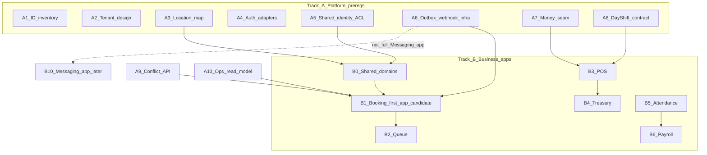

# DRVO-001 — Migration Order (Provisional)

| Field | Value |
|-------|-------|
| Document | `DRVO-001-MIGRATION-ORDER` |
| **Audited Git HEAD SHA** | `f5e43773545d25467af7b302b974191418a3f8dd` |
| Authority | **Provisional recommendations only.** This is **not** a final architecture or program plan. **DRVO-002** decides sequencing, owners, and cutovers. |

Companions: [EXTRACTION-AUDIT](./DRVO-001-EXTRACTION-AUDIT.md) · [DOMAIN-MAP](./DRVO-001-DOMAIN-MAP.md) · [DEPENDENCY-GRAPH](./DRVO-001-DEPENDENCY-GRAPH.md)

---

## How to use this document

Separate two different kinds of work:

1. **A. Technical / platform prerequisites** — scaffolding that reduces risk for *any* app extraction (identity, tenancy mapping, events, auth adapters). These are **not** the same as extracting a full business app.
2. **B. Provisional business-app extraction sequence** — candidate order for lifting product capabilities (Booking, Queue, POS, …).

Do **not** conflate:

| Concept | Meaning |
|---------|---------|
| Event / outbox / webhook **infrastructure** | Platform capability (durable messaging primitives) |
| Messaging / WhatsApp **app** | Product surface: inbox, campaigns, AI receptionist, template admin |

**Booking scheduling remains a valid candidate for the first major business-app extraction (LEVEL 1–2 with adapters).**  
It is **not** evidenced as ready for LEVEL 4 (independent Booking database).  
Booking bundles **A scheduling / B conversion / C composition / D notifications** are separate (EXTRACTION-AUDIT §19).  
Event/outbox/webhook infrastructure **may** be a prerequisite **without** extracting the full Messaging app before Booking scheduling.

---

## Extraction LEVEL vocabulary (mandatory)

| Level | Name | Meaning |
|-------|------|---------|
| **LEVEL 1** | Module boundary | Same deployment / same DB |
| **LEVEL 2** | Application/service boundary | Separate runtime; may share DB temporarily |
| **LEVEL 3** | Data ownership boundary | App owns tables/contracts |
| **LEVEL 4** | Physical database boundary | Separate DB/storage |
| **LEVEL 5** | Commercial packaging | Installable DRVO App / entitlement |

**EXTRACT in this document means provisional capability separation — not a chosen LEVEL.** DRVO-002 assigns levels.

---

## A. Technical / platform prerequisites (provisional)

Suggested gates before or alongside early app extracts. All items are **INFERRED FUTURE DESIGN** unless marked otherwise.

| Order (provisional) | Prerequisite | Why (evidence-backed) | Suggested exit criteria (for DRVO-002 to refine) | Status label |
|---------------------|--------------|----------------------|--------------------------------------------------|--------------|
| A1 | **Freeze audit baseline + ID inventory** | INT/`BIGINT`/composite invoice identities pervasive | Legacy ID catalog published; mapping table design sketched | VERIFIED CURRENT STATE need; INFERRED design |
| A2 | **Tenant model design (no runtime yet in Casher)** | No `TenantId` today | Decision record in DRVO-002; single-tenant bootstrap map from current DB | VERIFIED absent; INFERRED introduce |
| A3 | **Location mapping from `TblBranch`** | `BranchID` is multi-location key | Stable `BranchCode` → LocationId map; ban numeric GLEEM assumptions | VERIFIED CURRENT STATE |
| A4 | **Auth/session + ACL adapters** | HMAC cookie; `TblUserBranchAccess`; view vs operational branch | Documented session contract; DRVO auth adapter spike | VERIFIED CURRENT STATE |
| A5 | **Shared identity APIs (Customer, Employee, Catalog) — anti-corruption layer** | Global masters read/written by many apps | Read APIs + mapping for ClientID/EmpID/ProID; write ownership rules | VERIFIED masters; INFERRED ACL |
| A6 | **Event / outbox / webhook infrastructure** | `TblMessageOutbox`/`Inbox`, internal WhatsApp webhooks already exist | Durable outbox publish API usable by Booking without owning WhatsApp UX | VERIFIED infra fragments; INFERRED platformize |
| A7 | **Money-movement / posting contract (CashMove + trigger seam)** | `TblCashMove` hub + **`InsCashMoveSales`** AFTER INSERT on invoice head | Explicit posting/reversal/retry/recon API to replace trigger-backed atomicity when crossing DB boundaries | VERIFIED hub+trigger in-repo; production enablement NEEDS RUNTIME VERIFICATION; contract design deferred |
| A8 | **Day/Shift access contract (owner undecided)** | Financial writes via `resolveBranchDayAndShiftForWrite` | Published “resolve operational day/shift” API; **owner chosen in DRVO-002** | VERIFIED coupling; ownership undecided |
| A9 | **Occupancy / conflict API for workforce** | Global emp applocks + booking/queue conflict domain | Shared “employee busy intervals” service spanning locations | VERIFIED locks; INFERRED shared API |
| A10 | **Ops composition read-model (flow-board)** | `loadFlowBoardForBranch` cross-domain SQL | BFF/read-model so Booking/Queue extract does not break `/operations` | VERIFIED coupling; INFERRED read-model |
| A11 | **Subscriptions / entitlements stub** | Not present today | Replace/greenfield in Platform Core when SaaS packaging starts | VERIFIED absent; INFERRED REPLACE |
| A12 | **Audit/event logging standard** | Sensitive action audit + permission audit exist | Tenant-aware audit sink | VERIFIED partial; INFERRED ADAPT |

### A-notes

- **A6 before Booking scheduling** is a *soft* technical enabler for notifications, not a requirement to EXTRACT the Messaging app.
- **A7/A8** are **HARD BLOCKERS** for POS/Treasury/Payroll/convert across a DB boundary; weaker for Booking **scheduling** create/cancel.
- **A9** is a **HARD BLOCKER** for correct multi-service scheduling without shared locks or co-located DB.
- **A10** is a **SOFT PREREQUISITE** for floor UX continuity.

### A.1 Edge classification summary (provisional)

Full table: [DEPENDENCY-GRAPH §12](./DRVO-001-DEPENDENCY-GRAPH.md). Headline:

| Edge | Class |
|------|-------|
| Tenant/location identity | SOFT (single-tenant lift) / HARD (shared multi-tenant DB) |
| Customer / Emp / Catalog identity | SOFT PREREQUISITE |
| Emp global conflict locking | HARD BLOCKER (correctness) |
| Availability reads | SOFT / ADAPTER-SAFE |
| `/operations` flow-board | SOFT (UX) |
| WhatsApp notify | ADAPTER-SAFE |
| Day/Shift (scheduling reads) | ADAPTER-SAFE / SOFT |
| Day/Shift (financial writes) | HARD BLOCKER |
| Booking → POS conversion | HARD to extract early; legacy leave needs **explicit convert contract** (not dual-call) |
| CashMove + sale trigger posting | HARD BLOCKER for POS/treasury boundary split |
| Loyalty | ADAPTER-SAFE for scheduling extract |
| Reporting queries | ADAPTER-SAFE |
| Reporting config/overrides | SOFT if splitting admin |

---

## B. Provisional business-app extraction sequence

Order below is an **evidence-backed recommendation** for discussion in DRVO-002 — **not** a committed roadmap.

### B0. Shared Domains (foundational product data)

| Step | Capability | Provisional action | Rationale | Risk |
|------|------------|--------------------|-----------|------|
| B0.1 | Customers (`TblClient`) | EXTRACT shared | Global phone identity; booking/POS/loyalty depend | High |
| B0.2 | Workforce (`TblEmp` + assignments) | EXTRACT shared | Hybrid identity; global conflicts | Critical |
| B0.3 | Catalog (`TblPro`/`TblCat`/packages) | EXTRACT shared | Services for booking/POS/inventory | Medium |

These can proceed as **shared libraries/services** even while still deployed in the monolith.

### B1. First major business-app candidate: Booking **scheduling** (bundle A)

| Item | Provisional recommendation |
|------|----------------------------|
| Capability | Bundle **A** — availability / holds / create / cancel / reschedule / occupancy / slot claims |
| Action | **EXTRACT** candidate at **LEVEL 1–2** (shared DB + adapters) |
| **Not claimed** | LEVEL 4 independent Booking database |
| Why first | Cohesive engines; weaker CashMove/trigger dependence than POS |
| Prerequisites | Soft: identity maps, ops read-model, notify adapter; Hard for correctness: conflict locking (same DB or shared lock API) |
| Bundle **B** conversion | Leave on legacy only with **explicit cross-system convert contract** (DRVO-002); not bare dual-call |
| Bundle **C** composition | **SOFT** UX — flow-board read-model |
| Bundle **D** notifications | **ADAPTER-SAFE** — weaker than outbox reclaim |
| Convert facts (VERIFIED) | One TX: `خدمة` head+detail+completed; no payment/loyalty; no sale-trigger CashMove |
| Risk | High concurrency (global BookingCode, global IdempotencyKey, emp applocks) |

**Explicit statement:** “Booking first” means **scheduling bundle A** at LEVEL 1–2 with adapters — **not** moving conversion or claiming a separate Booking DB. DRVO-002 may still choose differently.

### B2. Queue (closely related)

| Item | Provisional recommendation |
|------|----------------------------|
| Action | EXTRACT soon after or in parallel track with Booking |
| Why | Same floor UX; shared conflict semantics; `QueueTickets` branch-owned |
| Risk | High coupling to `/operations` composition |

### B3. POS / Sales

| Item | Provisional recommendation |
|------|----------------------------|
| Action | EXTRACT after shared identities + day/shift financial contract + **posting contract replacing `InsCashMoveSales` semantics** (A7/A8) |
| Why | Invoice + **DB trigger CashMove** + split + loyalty post-commit + target enqueue |
| Also owns / related | Booking **conversion** adapter cutover |
| Risk | Critical |

### B4. Treasury / Expenses / Deductions / Budget

| Item | Provisional recommendation |
|------|----------------------------|
| Action | EXTRACT after money-movement / posting contract |
| Why | Orbit `TblCashMove` (app + trigger-fed sale rows) |
| Risk | Critical |

### B5. Attendance

| Item | Provisional recommendation |
|------|----------------------------|
| Action | EXTRACT (module already has substantive command services; still couples to `src/lib/hr`) |
| Why | Needed before clean payroll; ops presence depends on it |
| Risk | High |

### B6. Payroll + Employee Ledger + Targets

| Item | Provisional recommendation |
|------|----------------------------|
| Action | EXTRACT late among HR |
| Why | Nightly close stitches attendance + payroll + ledger + WhatsApp; dual-write |
| Risk | Critical |

### B7. Inventory / Purchasing

| Item | Provisional recommendation |
|------|----------------------------|
| Action | EXTRACT |
| Why | API-first; thinner UI; stock branch-owned after catalog |
| Risk | Medium |

### B8. Loyalty points core

| Item | Provisional recommendation |
|------|----------------------------|
| Action | EXTRACT |
| Why | Global balance on Client; sales earn/reverse hooks |
| Risk | Medium |

### B9. CUT Club / mystery-box economy

| Item | Provisional recommendation |
|------|----------------------------|
| Action | ADAPT — split **Industry Extension** branding/economy from generic loyalty |
| Why | `SalonID` legacy; salon-specific |
| Risk | High naming/tenant confusion |

### B10. Messaging / WhatsApp **app**

| Item | Provisional recommendation |
|------|----------------------------|
| Action | EXTRACT as Independent App **after or in parallel**, not as a hard gate before Booking |
| Why | Strong `src/modules/messaging` shape; many producers already |
| Depends on | A6 infra platformization |
| Risk | High fan-in |

### B11. AI receptionist + salon concierge knowledge

| Item | Provisional recommendation |
|------|----------------------------|
| Action | EXTRACT app + ADAPT industry knowledge pack |
| Why | Gemini + salon tools; depends on messaging + booking tools |
| Risk | High |

### B12. Reports / accounting classification / partners

| Item | Provisional recommendation |
|------|----------------------------|
| Action | ADAPT **read models** separately from **config/command** surfaces (partner overrides, classification settings, WhatsApp report sends) |
| Why | Reports are **not** assumed read-only |
| Risk | High if unscoped; Medium for override stores |

### B13. Provisional RETIRE candidates

| Item | Evidence | Provisional action |
|------|----------|--------------------|
| Approvals workflow | API **410** | RETIRE |
| Calendar sync | Ownership registry INACTIVE_LEGACY | RETIRE |
| One-off admin migration utility pages | Ops fix UIs | RETIRE from product surface |
| Treating `SalonID` as tenant | Unused/nullable pattern | RETIRE naming; use TenantId/LocationId in DRVO |

---

## C. Suggested parallel tracks (provisional)

---

## D. What DRVO-002 must decide (explicitly deferred)

1. Extraction **LEVEL** per domain (1–5 vocabulary above)  
2. Tenant isolation topology / namespace rules (uniqueness, applocks, caches, jobs, secrets, auth)  
3. Staff users vs customer identities vs platform administrators  
4. Scheduling/conflict **write authority**  
5. Booking **conversion** ownership and transaction semantics (vs scheduling extract) — explicit cross-system contract if convert stays in Casher (§19.1)  
6. Financial **posting / reversal / reconciliation / retry** (trigger + update≠create asymmetry + unused split reverse)  
7. Day / Shift ownership — **still undecided**  
8. CashMove ownership — **still undecided**  
9. Public **customer ownership / auth** beyond possession phone + bookingAccessToken (OTP/session — FUTURE)  
10. Master data vs snapshots / projections / balances  
11. Shared domain vs app vs industry-policy boundaries  
12. Durable job recovery / messaging intent (outbox vs booking after() notify)  
13. Config storage (DB / env / filesystem JSON / process memory)  
14. Cutover + rollback gates  
15. Whether **first extract** is Booking scheduling, Queue, or thinner slice  
16. Claims mode production setting + reschedule idempotency recovery (**NEEDS RUNTIME VERIFICATION**)  

---

## E. Alignment checks

| Check | Result in this audit |
|-------|----------------------|
| Prerequisites separated from app extract order | Yes (§A vs §B) |
| EXTRACT LEVEL vocabulary explicit | Yes |
| Booking scheduling valid LEVEL 1–2 candidate | Yes (§B1) |
| Booking A/B/C/D bundles distinguished | Yes (§B1) |
| Not claiming LEVEL 4 Booking DB | Yes |
| Messaging infra ≠ Messaging app | Yes |
| DB trigger financial side effects documented | Yes |
| Auth / concurrency / financial matrices present | Yes (EXTRACTION-AUDIT §§15–17) |
| Public customer ownership separate from staff RBAC | Yes (§16.3) |
| Claim enforcement classes + reschedule recovery semantics | Yes (§17 / §17.1) |
| HARD / SOFT / ADAPTER-SAFE edges present | Yes — dual-call **not** assumed adapter-safe for shared-TX convert |
| Convert leave-on-legacy needs explicit contract | Yes (§19.1 / B1) |
| Day/Shift undecided | Yes |
| CashMove ownership undecided | Yes |
| Reports not assumed read-only | Yes |
| Language is provisional | Yes |
| Ready for final Codex verification | Yes |
| Ready for DRVO-002 decision work | Yes — as dossier; open questions mandatory |
