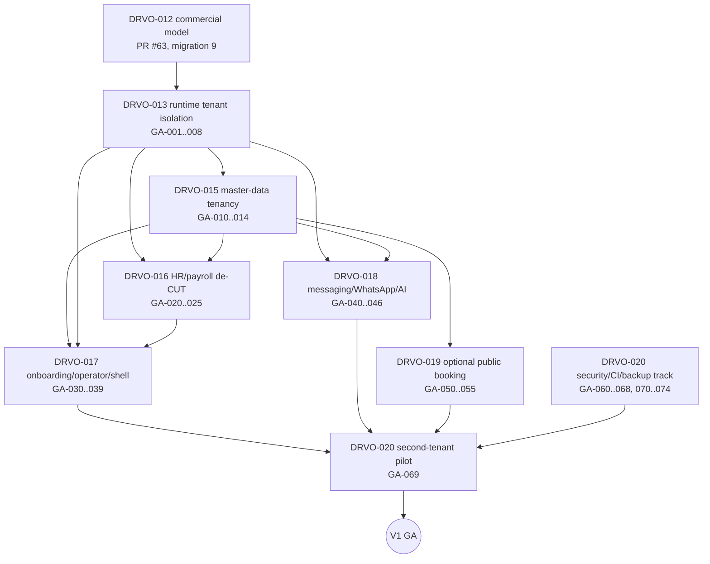

# DRVO-014 — Finish-Line Gap Audit

Issue: #62 · Parent epic: #60 · Register: [`DRVO-014-GA-BLOCKER-REGISTER.md`](./DRVO-014-GA-BLOCKER-REGISTER.md)

Docs only. No runtime change, no migration, no database access. Findings come from reading code on
`origin/main@2401620`, `drvo-012-commercial-plans-tenant-apps@2c056a3` (PR #63) and
`drvo-013-authoritative-tenant-context@db87e66` (stacked on DRVO-012). Every finding is a `GA-xxx` row in the
register, which holds the evidence, severity, owner and launch-blocking flag. This document explains the areas,
the dependencies between owners, and the proof needed to close them.

## 1. Bottom line

- DRVOERP today is a **single-business salon system with a platform skeleton**. Only the 8 platform tables and
  `TreasuryMovementRegistry` carry `TenantId`; every `Tbl*` business table is global or branch-keyed.
- DRVO-012 (commercial model) and DRVO-013 (authoritative tenant context) are written but **not merged** and
  have no runtime staging proof (GA-007). DRVO-013 fixes the implicit `CASHER_BOOT` tenant, global branch/user
  admin and the platform-operator boundary, but does **not** cover unauthenticated routes, cron jobs or most app
  entitlement gates (GA-002, GA-005, GA-006).
- Even with DRVO-013 merged, a second tenant would see CUT's customers, catalog, payment methods, employees and
  messaging (DRVO-015, DRVO-016, DRVO-018), could not log in after onboarding (GA-030), and would print CUT
  branding (GA-035).
- Independent of tenancy, there are production security blockers today: plaintext passwords, unauthenticated
  customer APIs that spend loyalty points, and an SQL injection (GA-060..062).
- **GA blocker count: 38** (13 CRITICAL, 25 HIGH). **Unowned blockers: 0.**

## 2. Area audit

Each area lists current behaviour, the target boundary, and the register rows. "Fixed on `[013]`" means fixed on
the unmerged DRVO-013 branch only.

### 2.1 Route auth

- **Current.** `src/proxy.ts` only checks that the `pos_session` cookie is present; handlers are meant to be
  authoritative. Of 410 route files, 47 have no handler-level auth; 40 of those are real business endpoints
  (customers, services/categories writes, finance categories, budget, loyalty, payroll monthly, POS voucher and
  client inventory, schedule overrides) plus 7 unguarded methods in guarded files. 51 routes rely on
  `getSession()` only (signature + expiry, no user/membership recheck). Dev/debug/db routes are correctly gated
  by `requireDevelopmentAdmin` (404 in production).
- **`[013]`.** `authenticate()` re-resolves membership + location per call and applies the subscription gate,
  but the 40 unauthenticated files and `proxy.ts` are unchanged.
- **Target.** Every tenant-owned route resolves an authoritative tenant or fails closed; proxy remains a coarse
  filter only. A static guard test enumerates every `route.ts` and classifies it (public / system-job /
  tenant-authenticated / platform-operator).
- **Rows.** GA-002 (DRVO-013), GA-008, GA-063, GA-072 (DRVO-020).

### 2.2 TenantId ownership

- **Current.** `TenantId` exists only on `Tenant`, `Location`, `LegacyIdMap`, `TenantMembership`,
  `PlatformOutbox`, `TenantAppEntitlement`, `SalonPackConfig`, `TreasuryMovementRegistry`. Branch-keyed only:
  sales heads, cash moves, treasury close, payroll/ledger tables, purchase heads, business day/shift,
  attendance, bookings, queue. Neither key: `TblClient`, `TblPro`, `TblCat`, `TblEmp`, `TblExpINCat`,
  `TblPaymentMethods`, `TblSettingValues`, loyalty tables, `TblUser`, `TblRoles`, `TblUserRoles`, all messaging
  and concierge tables.
- **Target.** Branch-keyed tables derive tenant through `TblBranch → Location → Tenant` (enforced in DRVO-013
  for branch access). Tables with no key get an explicit tenant owner (column or ownership map) in the task that
  owns the domain.
- **Rows.** GA-001, GA-003 (DRVO-013); GA-010..013 (DRVO-015); GA-021 (DRVO-016); GA-032 (DRVO-017);
  GA-040 (DRVO-018).

### 2.3 CUT hardcodes

Concentrated in HR/payroll, branch setup, messaging/AI, receipts and public booking; the Salon pack on main is a
23-line manifest used only by tests (DRVO-012 replaces it with a real pack definition). See §7 for the full
move-to-pack list.
- **Rows.** GA-020, GA-022, GA-023, GA-024 (DRVO-016); GA-035, GA-036, GA-037 (DRVO-017); GA-042, GA-044
  (DRVO-018); GA-051 (DRVO-019); GA-014 (loyalty, deferred).

### 2.4 Workers

- **Current.** Three systemd messaging workers (outbox, inbox, AI) claim with `UPDLOCK, READPAST` but no tenant
  filter and use one global pool and gateway. Target recalc is a manual CLI. `PlatformOutbox` has a publisher but
  no consumer on main.
- **`[013]`.** Adds a `PlatformOutbox` consumer that builds `JobTenantContext` from each row and dead-letters
  rows without a valid `TenantId`; binds the legacy messaging worker to `CASHER_BOOT` via a named seam.
- **Target.** Every tenant-sensitive claim carries `TenantId` from the claimed row; messaging workers serve
  multiple tenants with per-tenant channel configuration.
- **Rows.** GA-041, GA-046 (DRVO-018); GA-071 (DRVO-020).

### 2.5 Cron

- **Current.** `vercel.json` lists 3 crons but production is a VPS; the nightly-close systemd timer is disabled
  on deploy; payroll auto-generate is a Windows Task Scheduler script. `requireSystemJobAuth` returns
  `tenantId: null`, and jobs loop over every active `TblBranch` row. Auto-absence is POST-only and missing from
  the cron bearer allowlist.
- **Target.** Jobs enumerate tenants, then each tenant's Locations, with a `JobTenantContext` per unit of work,
  and are deployed as tracked systemd units.
- **Rows.** GA-005 (DRVO-013); GA-025 (DRVO-016); GA-070 (DRVO-020).

### 2.6 Messaging

- **Current.** Self-hosted WhatsApp Web gateway on loopback, one sender for the process; inbound webhook payload
  has no tenant; conversations and inbox rows are globally unique per contact; templates resolve
  branch → global with CUT defaults; groups and campaigns are global.
- **Target (V1 capability, cross-industry).** Tenant-owned channels (credentials, sender, webhook secret),
  `TenantId` on every messaging row, tenant resolution for inbound by channel, tenant-scoped templates with
  pack-provided defaults, entitlement-gated.
- **Rows.** GA-040, GA-041, GA-044, GA-045 (DRVO-018).

### 2.7 AI Receptionist

- **Current.** `src/apps/ai-receptionist` is a skeleton; the real code is `src/modules/messaging/ai/**`, hard-wired
  to CUT (URLs, phones, prices, two branches, hours, Arabic salon prompt) with one global Gemini key and no cost
  controls. Concierge migration/bootstrap scripts refuse any database other than `last132` and run on every
  deploy.
- **Target.** Pack-supplied prompt skeleton + tenant knowledge base (`TblSalon*` becomes tenant-scoped
  knowledge), tenant enablement and quota, booking actions executed as a tenant service actor.
- **Rows.** GA-042, GA-043 (DRVO-018); GA-066 (DRVO-020, deploy-time migrations).

### 2.8 Public APIs

- **Booking (`/api/public/booking/**`).** Branch-code derived; `[013]` derives tenant for create/hold/cancel.
  Remaining: cross-tenant upcoming-by-phone (GA-050, blocking), CUT catalog host/defaults (GA-051), global CORS
  and identity (GA-052), `Math.random` codes (GA-053), entitlement gating of reads (GA-054). Rate limiting is
  in-memory per instance (GA-063).
- **Customer (`/api/public/client/**`, `/api/client/*`).** No customer authentication, CORS `*`, writes points and
  profiles — CRITICAL today for CUT itself (GA-061, DRVO-020).
- **Other.** `/api/public/services/[id]/steps` runs DDL anonymously (GA-066); `v2/isolated-probe` leaks DB info
  when its env gate passes (GA-073).

### 2.9 Onboarding

- **Current.** `POST /api/admin/platform/tenants` provisions tenant + first branch (inactive, SETUP) + owner +
  membership + registry in one transaction; `[013]`/DRVO-012 add plan, subscription, pack composition and
  limits. The owner cannot log in (GA-030); no operational baseline is seeded (GA-031); branch setup is
  CAMP_CAESAR-specific (GA-036); RBAC is global (GA-032).
- **Target.** Operator creates tenant from UI → owner logs in to a setup console → pack recipe seeds baseline
  master data and roles → owner activates first Location when readiness passes. No SQL or scripts.
- **Rows.** GA-030, GA-031, GA-032, GA-036 (DRVO-017).

### 2.10 Operator APIs / UI

- **Current.** Main: 3 operator routes (tenant list/create, readiness). `[013]`: 13 routes (plans, packs, apps,
  subscription lifecycle, install/uninstall/apply-pack, commercial access) guarded by a real
  `requirePlatformOperator`. No UI on any branch.
- **Rows.** GA-004 (DRVO-013); GA-033, GA-034 (DRVO-017).

### 2.11 Branding

- **Current.** "Cut Salon" in app metadata, login, nav logo (`/cutsalon.png`), receipts, tickets, shift-close
  receipts, PDF reports, WhatsApp defaults; theme `cut-gold` per user cookie; `Tenant` has no branding fields;
  per-branch `QueueBookingSettings.SalonName/LogoUrl` seeded with CUT values.
- **Rows.** GA-035 (DRVO-017); GA-044 (DRVO-018); GA-051, GA-052 (DRVO-019).

### 2.12 Security

Plaintext passwords (GA-060), unauthenticated customer APIs (GA-061), SQL injection (GA-062), no login throttle,
non-constant-time comparisons (GA-063), no headers/CSRF (GA-064), stateless non-revocable sessions (GA-072).
Positive: no secrets tracked; `.env*` ignored; dev routes 404 in production; sensitive-action audit exists for
treasury/financial edits. All DRVO-020 except GA-002 (DRVO-013).

### 2.13 Backups / observability

No backup or restore tooling, no DR runbook, `backup_reference` is unverified free text (GA-067). Logging is raw
`console.*`, no error tracking, no tenant-tagged logs, deploy health check fetches `/login`, audit log has no
`TenantId` (GA-068). All DRVO-020.

### 2.14 Migrations / deploy

- **Controlled.** `scripts/drvo/migrations` 001–008 (+009 on PR #63) with ledger, checksums, staging gate
  workflow (on PR #63) and a production apply workflow requiring explicit approval.
- **Uncontrolled.** Deploy runs legacy messaging/concierge migrations and a CUT data bootstrap on every deploy;
  18 HTTP migrate routes; ~150 legacy migration artifacts (GA-066).
- **Deploy.** Every push to `main` deploys without waiting for CI; CI runs a subset; build ignores TS errors
  (GA-065); in-place build with no atomic rollback (GA-070).

## 3. Dependency graph

Edge rationale:
- **012 → 013.** DRVO-013 is stacked on DRVO-012 and evaluates its subscription/app gates.
- **013 → 015/016/018.** Tenant-scoping master data, employees or messaging is meaningless until requests and
  jobs carry an authoritative tenant.
- **015 → 016/017/018/019.** Employees reference catalog and payment methods; onboarding seeds master data;
  messaging resolves customers; public booking serves the catalog.
- **016 → 017.** The setup console's employees/payroll steps need branch-generic HR.
- **All → pilot.** The second-tenant pilot is the only acceptable proof of isolation (GA-069).

## 4. Critical path vs parallel work

**Critical path:** DRVO-012 merge + migration 9 → DRVO-013 (incl. GA-002, GA-005, GA-006) → DRVO-015 →
DRVO-016 → DRVO-017 → DRVO-020 pilot.

**Can run now, in parallel with DRVO-013** (no tenant-context dependency):

| Work | Rows | Owner |
| --- | --- | --- |
| Password hashing + migration of existing passwords | GA-060 | DRVO-020 |
| Lock down customer APIs (auth/OTP or disable), fix SQL injection | GA-061, GA-062 | DRVO-020 |
| Login throttling, constant-time compares, security headers, CSRF/Origin | GA-063, GA-064 | DRVO-020 |
| CI gate before deploy, typecheck/lint ratchet | GA-065 | DRVO-020 |
| Move deploy-time legacy migrations under control plane; retire HTTP migrate routes | GA-066 | DRVO-020 |
| Backups + restore drill; logging/error tracking/health | GA-067, GA-068 | DRVO-020 |
| De-hardcode GLEEM/CAMP_CAESAR in HR (branch-list driven, still CUT data) | GA-020, GA-022, GA-023 | DRVO-016 |
| Branding abstraction (tenant/branch brand settings, CUT values as data) | GA-035 | DRVO-017 |
| Messaging channel abstraction design (no schema yet) | GA-041 | DRVO-018 |

**After DRVO-013:** DRVO-015 schema/ownership work, DRVO-016 `TblEmp` tenancy, DRVO-017 operator/tenant UI and
RBAC, DRVO-018 messaging tenancy, DRVO-019 public booking tenancy.

## 5. Migration risk per area

| Area | Owner | Schema change expected | Risk | Why |
| --- | --- | --- | --- | --- |
| Commercial model | DRVO-012 (GA-007) | Migration 9 (additive) | Medium | Must apply before merge (deploy runs `drvo:verify`); grandfathers existing tenants |
| Runtime tenant context | DRVO-013 | None | High (operational) | Fails closed: users without `TenantMembership`/branches without `Location` lose access; all sessions invalidated once |
| Master data | DRVO-015 | Add tenant ownership to `TblClient`, `TblPro`, `TblCat`, `TblPaymentMethods`, `TblExpINCat`, `TblSettingValues` | **High** | Hot legacy tables used by POS, booking, reports, legacy desktop client; backfill to `CASHER_BOOT`; unique indexes become tenant-composite |
| HR/payroll | DRVO-016 | `TblEmp` ownership; replace JSON files with tables | High | Payroll/ledger money paths; must keep CUT month-end parity |
| Onboarding/RBAC/branding | DRVO-017 | Tenant-scoped roles; brand/settings columns | Medium | `TblRoles.RoleKey` uniqueness changes; permission resolution on every request |
| Messaging/AI | DRVO-018 | `TenantId` on ~13 messaging/concierge tables; channel config table | High | Live workers; conversation uniqueness and idempotency keys change |
| Public booking | DRVO-019 | Possibly none (tenant derivation via branch) | Low–Medium | Read-path filters; CORS/identity config |
| Hardening | DRVO-020 | Password hash column; audit `TenantId` | Medium | Password migration must not lock out CUT staff (dual-verify window) |

All schema changes go through DRVO migration control, staging (`last132_agent`) first, production apply only by
explicit approval.

## 6. Staging / E2E proof required per owner

A register row closes only with its owner's proof below. Unit tests are necessary, not sufficient.

| Owner | Required proof |
| --- | --- |
| DRVO-013 | `drvo-013-tenant-isolation-smoke` PASS on `last132_agent` with two synthetic tenants; route census test proving no unauthenticated tenant-owned route; cron run showing per-tenant job context; disabled-app routes return 403 for a tenant without the app; CASHER_BOOT regression smokes (DRVO-005..010) green; production `verifyPlatformBootstrap` preflight clean |
| DRVO-015 | Two tenants with overlapping customer phones and service names: each sees only its own; POS sale + booking + report per tenant; CUT backfill row counts reconciled |
| DRVO-016 | New tenant with arbitrary branch codes runs attendance → daily payroll → ledger → monthly report; CUT month-end payroll parity vs previous month |
| DRVO-017 | Operator creates tenant in UI; owner logs in, completes setup console, activates Location, sells — no SQL/scripts; receipts show tenant brand |
| DRVO-018 | Two tenants with separate channels: inbound routed to the right tenant, outbound from the right sender, AI answers from the tenant's knowledge, quota enforced; CUT messaging regression |
| DRVO-019 | Tenant B booking enabled: upcoming/lookup/cancel never return tenant A data; tenant without Booking app has no public surface |
| DRVO-020 | Security review PASS; restore drill evidence (time-to-restore recorded); CI gate blocks a failing PR from deploying; error tracking receives a tagged test event; **second real non-CUT tenant pilot** with zero cross-tenant leakage and CUT regression suite green |

## 7. CUT-specific assumptions that must move into Salon Pack or tenant config

| Assumption | Where today | Destination | Owner |
| --- | --- | --- | --- |
| Two branches `GLEEM`/`CAMP_CAESAR` as fixed scope | HR/payroll/ledger/closing (GA-020) | Tenant Location list | DRVO-016 |
| Partner names, EmpIDs, share %, effective dates | GA-022 | Tenant partner configuration (data) | DRVO-016 |
| Partner overrides / target templates JSON files | GA-023 | Tenant-scoped tables | DRVO-016 |
| "Cut Salon" brand, logo, receipt titles, theme | GA-035 | Tenant/Location brand settings | DRVO-017 |
| Branch setup wizard defaults (Camp Caesar, transfer from GLEEM) | GA-036 | Pack setup recipe + tenant data | DRVO-017 |
| Roles/page access seeded by personal login name | GA-022, GA-032 | Pack role template + tenant RBAC | DRVO-017 |
| `Africa/Cairo`, `EGP`, 04:00 cutoff | GA-037 | `Tenant`/`Location` settings (defaults remain Egypt) | DRVO-017 |
| Job title `حلاق` as bookable-staff marker | `src/lib/operations/loadFlowBoardForBranch.ts:130,166`, `src/lib/types.ts:526` | Salon Pack staff-role mapping | DRVO-016 |
| WhatsApp defaults, templates, owner name | GA-044 | Pack template defaults + tenant overrides | DRVO-018 |
| Concierge knowledge, URLs, phones, prices, hours | GA-042 | Tenant knowledge base; pack prompt skeleton | DRVO-018 |
| Public booking catalog host `GLEEM`, `Cut Salon` defaults | GA-051 | Tenant public-site config | DRVO-019 |
| CUT CLUB loyalty brand | GA-014 | Salon Pack extension, CASHER_BOOT only in V1 | DRVO-015 (deferred) |
| Quick-queue service ID `9` | `src/lib/quickQueueConfig.ts:6` | Tenant queue setting | DRVO-015 |

## 8. Generic app / pack / admin requirements

1. **Pack = recipe, not fork.** A pack supplies app set, setup steps, default roles, template defaults and
   terminology; tenant data overrides it. No pack code branches on tenant or branch codes.
2. **App gate everywhere.** Every app route and job checks the tenant's installed app (GA-006); disabled apps
   keep data but expose no surface.
3. **Tenant settings surface.** Brand, timezone, currency, business-day cutoff, printer, public identity.
4. **Tenant RBAC.** Roles and page access per tenant, created from the pack template at onboarding.
5. **Setup console.** Readiness-driven steps; the owner activates the first Location.
6. **Operator console.** Tenants, plans, subscriptions, packs, apps, readiness, suspend/reactivate — over the
   existing DRVO-012 APIs.

## 9. Proposed sequence

| # | Stream | Owner | Starts | Notes |
| --- | --- | --- | --- | --- |
| 0 | Security quick wins (GA-060..064), CI gate (GA-065) | DRVO-020 | Now | Protects CUT production regardless of SaaS work |
| 1 | Land DRVO-012 + DRVO-013 incl. route census, cron context, app gates | DRVO-013 | Now | GA-007 closes on staging proof + production preflight |
| 2 | Hardening/observability/backup (GA-066..068) | DRVO-020 | Now | Parallel |
| 3 | Master data tenancy: customers, catalog, payment methods, settings, inventory/purchasing | DRVO-015 | After 1 | Critical path |
| 4 | HR/attendance/payroll de-CUT + `TblEmp` tenancy | DRVO-016 | De-hardcoding now; tenancy after 3 | |
| 5 | Messaging/WhatsApp/AI tenancy | DRVO-018 | After 1 (schema after 3) | V1 capability |
| 6 | Tenant Admin & Setup Console, operator UI, RBAC, branding | DRVO-017 | UI shell after 1; seeding after 3–4 | |
| 7 | Reports/analytics | — | Covered inside 3/4 | Reports read branch-keyed tables; tenant scope comes from DRVO-013 branch access + DRVO-015/016 ownership. No separate task. |
| 8 | Optional public booking | DRVO-019 | After 3 | GA-050 blocks only while Booking is installable for non-CUT tenants |
| 9 | Billing provider | — | Post-V1 | GA-075 deferred |
| 10 | Second-tenant pilot + GA tag | DRVO-020 | After 3–8 | GA-069 |

## 10. Consistency checks performed

- Every `GA-xxx` ID in this file exists in the register.
- Register severity totals (13 / 26 / 16 / 4 = 59) and owner blocking totals (7+3+4+7+6+1+10 = 38) agree.
- Every row has exactly one owner in DRVO-013..DRVO-020 and a YES/NO blocking flag.
- No runtime files, migrations or scripts changed by this PR (`git diff --stat origin/main` touches `docs/` only).
